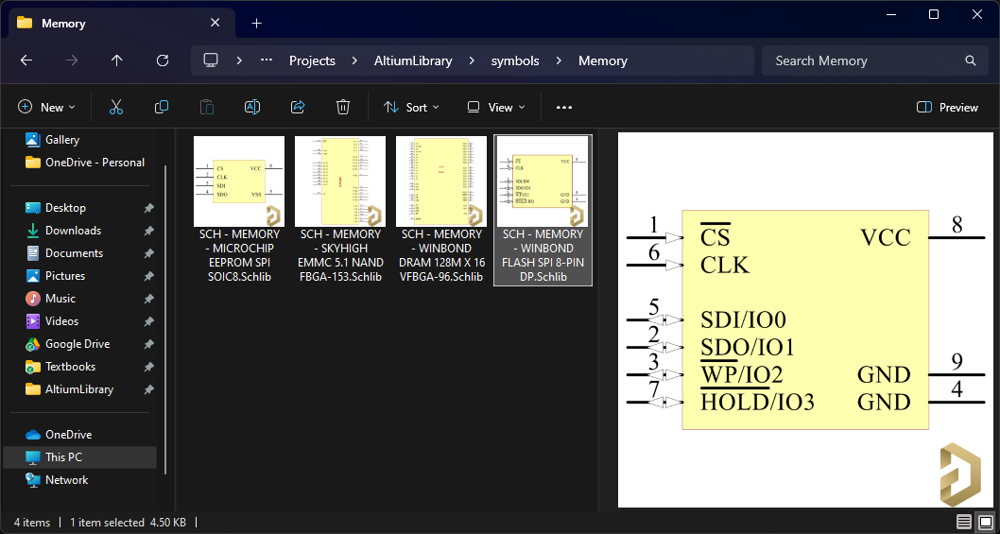
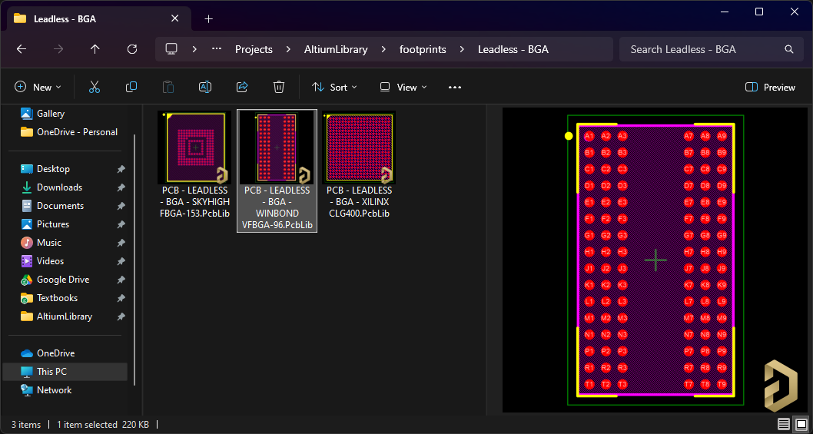

# Altium Thumbnail Handler

Thumbnail handler for Altium Designer .SchLib and .PcbLib file types. The handler renders the first symbol/footprint in the library file.

The handler code was based on the Microsoft [RecipeThumbnailProvider](https://github.com/microsoft/Windows-classic-samples/tree/main/Samples/Win7Samples/winui/shell/appshellintegration/RecipeThumbnailProvider). Rendering is done using the [AltiumSharp](https://github.com/issus/AltiumSharp) .NET library.

To register the handler:
```
regsvr32 AltiumThumbnailProviderCpp.dll
```

To unregister the handler:

```
regsvr32 /u AltiumThumbnailProviderCpp.dll
```





